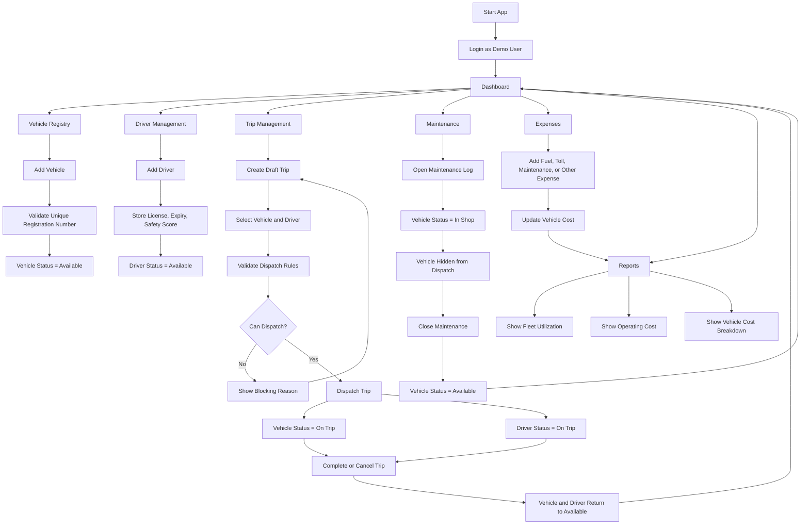

# TransitOps MVP

TransitOps is a smart transport operations platform for hackathon demos. It helps a logistics team manage vehicles, drivers, trips, maintenance, expenses, and operational reports from one dashboard.

## Tech Stack

- React
- TypeScript
- Vite
- Lucide React icons
- Browser `localStorage` for MVP persistence

## Current Features

- Demo login with seeded roles
- Dashboard KPIs and risk alerts
- Vehicle registry
- Driver management
- Trip creation, dispatch, completion, and cancellation
- Dispatch validation rules
- Automatic vehicle and driver status updates
- Maintenance workflow
- Fuel, toll, maintenance, and other expense tracking
- Reports with vehicle cost and utilization views

## Application Flowchart



## Core Business Rules

- Vehicle registration number must be unique.
- Retired, in-shop, or on-trip vehicles cannot be dispatched.
- Suspended, off-duty, or on-trip drivers cannot be dispatched.
- Drivers with expired licenses cannot be dispatched.
- Cargo weight cannot exceed vehicle capacity.
- Dispatching a trip changes the vehicle and driver to `On Trip`.
- Completing a trip restores the vehicle and driver to `Available`.
- Cancelling a dispatched trip restores the vehicle and driver to `Available`.
- Opening maintenance changes the vehicle to `In Shop`.
- Closing maintenance restores the vehicle to `Available`.

## Run Locally

```bash
npm install
npm run dev
```

## Build

```bash
npm run build
```

## Demo Flow

1. Log in as `Fleet Manager`.
2. Show dashboard KPIs.
3. Add a vehicle.
4. Add a driver.
5. Create a draft trip.
6. Dispatch the trip.
7. Show the vehicle and driver moving to `On Trip`.
8. Complete or cancel the trip.
9. Show the vehicle and driver returning to `Available`.
10. Open a maintenance log.
11. Show the vehicle moving to `In Shop`.
12. Add expenses.
13. Show reports updating.

## Team Work Files

- `TEAM_FRONTEND_UI.md`
- `TEAM_BUSINESS_LOGIC.md`
- `TEAM_DEMO_DOCS_TESTING.md`

## Suggested Next Work

- Add edit/delete actions
- Add filters and search
- Add CSV export
- Add real authentication and RBAC guards
- Add backend API and database
- Add screenshots to this README
