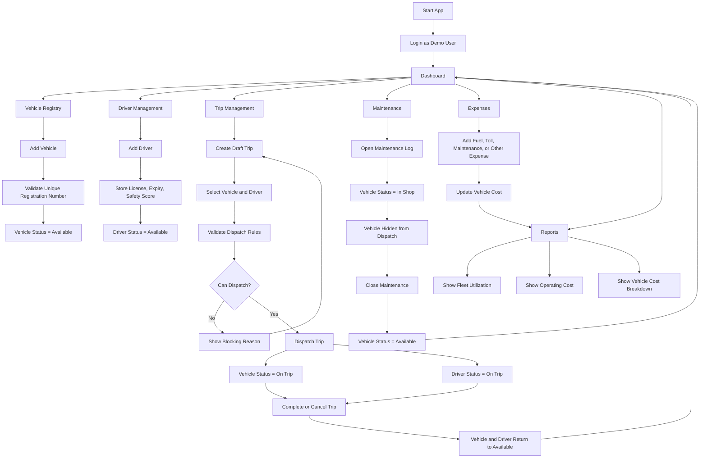

# TransitOps MVP

> A smart transport operations platform for managing fleet vehicles, drivers, trips, maintenance, and expenses — built for hackathon demo.

TransitOps gives a logistics team a single dashboard to run their fleet. It enforces real dispatch rules, tracks operational costs, and keeps vehicle and driver statuses in sync across the full trip lifecycle.

---

## Tech Stack

| Layer | Technology |
|-------|-----------|
| Framework | React 18 + TypeScript |
| Build Tool | Vite |
| Icons | Lucide React |
| Persistence | Browser `localStorage` (MVP) |
| Styling | Vanilla CSS |

---

## Features Completed

- **Demo login** with four seeded roles — no backend required
- **Dashboard KPIs** — active vehicles, in-shop count, active trips, driver pool, operating cost
- **Risk Alerts** — expired licenses and active maintenance issues flagged automatically
- **Vehicle Registry** — add vehicles with unique registration number enforcement
- **Driver Management** — expired license and suspended driver tracking
- **Trip Lifecycle** — Draft → Dispatch → Complete / Cancel
- **Dispatch Validation** — all business rules enforced at dispatch time
- **Automatic Status Updates** — vehicle and driver statuses sync with trip lifecycle
- **Maintenance Workflow** — open/close maintenance logs with vehicle locking
- **Expense Tracking** — fuel, toll, maintenance, and other expense logging
- **Reports** — vehicle cost breakdown, fleet utilization snapshot, ROI summary
- **Reset Demo Data** — one-click reset to original seed state
- **Empty States** — all tables show clean messages when empty
- **Delete Draft Trips** — remove unwanted drafts before dispatch

---

## Core Business Rules

| Rule | Enforced At |
|------|-------------|
| Vehicle registration number must be unique | Add vehicle |
| Retired, in-shop, or on-trip vehicles cannot be dispatched | Dispatch (filtered from form) |
| Suspended, off-duty, or on-trip drivers cannot be dispatched | Dispatch (filtered from form) |
| Drivers with expired licenses cannot be dispatched | Dispatch (validation alert) |
| Cargo weight cannot exceed vehicle capacity | Dispatch (validation alert) |
| Dispatching a trip → vehicle and driver become `On Trip` | Dispatch |
| Completing a trip → vehicle and driver return to `Available` | Complete |
| Cancelling a dispatched trip → vehicle and driver return to `Available` | Cancel |
| Opening maintenance → vehicle becomes `In Shop` | Maintenance open |
| Closing maintenance → vehicle returns to `Available` | Maintenance close |

---

## Demo Login Roles

| Name | Email | Role | Access |
|------|-------|------|--------|
| Akshit Wadhwa | fleet@transitops.dev | Fleet Manager | Full app access — use this for the demo |
| Meera Nair | safety@transitops.dev | Safety Officer | Risk and compliance view |
| Rohan Shah | finance@transitops.dev | Financial Analyst | Expenses and reports view |
| Arjun Driver | driver@transitops.dev | Driver | Trips view |

> The MVP allows all roles to access all pages. Role-based access guards are planned for the next iteration.

---

## Seeded Demo Data

The seed data is pre-loaded to demonstrate all key scenarios immediately after login:

| Scenario | Details |
|----------|---------|
| Active dispatched trip | Mumbai Hub → Pune Warehouse (vehicle + driver On Trip) |
| Vehicle in maintenance | Eicher Pro 2049 is In Shop — blocked from dispatch |
| Retired vehicle | SML Isuzu Samrat — blocked from dispatch |
| Expired license driver | Sameer Khan — will be blocked if dispatch is attempted |
| Suspended driver | Neha Sethi — blocked from dispatch dropdown |
| Draft with expired driver | Delhi Depot → Noida Retail Park — dispatch it to show the block |
| Completed trip | Chennai Port → Bengaluru Depot (historical record) |
| Multiple expense records | Fuel, maintenance, and toll expenses for report data |

---

## Application Flowchart



---

## Run Locally

```bash
npm install
npm run dev
```

Open [http://localhost:5174](http://localhost:5174) in your browser.

## Build for Production

```bash
npm run build
```

Preview the production build:

```bash
npm run preview
```

---

## Demo Script

> **Role:** Log in as **Akshit Wadhwa — Fleet Manager**. Click **Reset Demo Data** first if you need a clean slate.

| Step | Action | What to Point Out |
|------|--------|------------------|
| 1 | Open the app, click **Fleet Manager** on the login screen | Role-based logins, no backend needed |
| 2 | Review the **Dashboard** | 5 KPI cards, Live Trips table, Risk Alerts (expired license + in-shop vehicle flagged automatically) |
| 3 | Go to **Vehicles → Add Vehicle** | Fill in any registration number, click Add. Then try the same number again — show the duplicate-block error |
| 4 | Go to **Drivers → Add Driver** | Add a driver with a future expiry. Point out Sameer Khan's **Expired** compliance badge |
| 5 | Go to **Trips → Create Trip** | Pick an available vehicle + driver, fill details, click **Add Draft Trip** |
| 6 | Click **Dispatch** on the new draft | Trip → Dispatched, vehicle and driver → **On Trip** (verify in Vehicles and Drivers pages) |
| 7a | Find **Delhi Depot → Noida Retail Park** (Draft), click **Dispatch** | Block: *"Sameer Khan has an expired license."* |
| 7b | Create a draft using `DL-01-TA-4521` (750 kg capacity), cargo = `1500` kg, then Dispatch | Block: *"Cargo 1500 kg exceeds vehicle capacity 750 kg."* |
| 7c | Show the Vehicle dropdown on any new trip | `MH-12-BX-1180` (On Trip) and `KA-05-RF-9012` (In Shop) are absent — only Available vehicles shown |
| 8 | Click **Complete** on a Dispatched trip | Trip → Completed, vehicle and driver → **Available** |
| 9 | Go to **Maintenance → Create Log** for an Available vehicle | Vehicle → **In Shop**, appears in Dashboard Risk Alerts. Then **Close** it — vehicle returns to **Available** |
| 10 | Go to **Expenses**, add a Fuel entry | Appears in ledger instantly |
| 11 | Go to **Reports** | Vehicle Cost Breakdown bars, Fleet Utilization tiles, Revenue vs Cost ROI |
| 12 | Click **Reset Demo Data** (top bar) | All data returns to original seed state |

**Talking points:**
- *"The system enforces operational rules — invalid dispatches are blocked before they cause real-world conflicts."*
- *"Vehicle and driver statuses update automatically as trips and maintenance move through their lifecycle."*
- *"This is an MVP scoped for demo — it can be extended with a real backend, RBAC, and mobile support."*


## Future Scope

- Edit and delete vehicles, drivers, and expenses
- Filters and search across all tables
- CSV export for reports
- Real authentication with backend RBAC guards
- REST API + database backend (Node.js / PostgreSQL)
- Map view for live trip tracking
- Push notifications for maintenance due dates
- Multi-tenant support for fleet companies

---

## Team Work Files

- [`TEAM_FRONTEND_UI.md`](./TEAM_FRONTEND_UI.md) — UI and visual polish tasks
- [`TEAM_BUSINESS_LOGIC.md`](./TEAM_BUSINESS_LOGIC.md) — Validation, rules, and status transitions
- [`TEAM_DEMO_DOCS_TESTING.md`](./TEAM_DEMO_DOCS_TESTING.md) — Demo, docs, and test checklist tasks
